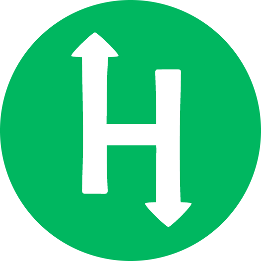

<div align=center>
  <h1>
    Hello, welcome!</br>
  </h1>
</div>

<a href="https://github.com/dogl4">back to my profile</a>

### About

My name is <b>Pedro Douglas Pereira Barreto</b>. I currently live in Taubaté, SP - Brazil. Since I was a teenager I've been <b>passionate about technology</b>, that's why I find it easy to learn quickly in this area. I intend to continue in this field throughout my life. I did <b>Technical in Computer Science for Internet</b> at Escola Estadual <b>ETEC</b>. I am currently participating in a <b>fullstack web development</b> bootcamp at [Trybe](https://www.betrybe.com/). My portfolio [dogla.com.br](https://dogla.com.br/ "Personal Site").

##

### Personal interests

- 💖 &nbsp;I'm fascinated by subjects as: technologies, investment and quality of life.
- 🔗 &nbsp;₿itcoin enthusiastic.

##

#### Tools

 <div align=center>

  [](https://www.gnu.org/software/bash/ "Bash")
  [](https://getbootstrap.com "Bootstrap")
  [](https://www.chaijs.com/ "Chai")
  [](https://www.w3schools.com/css/ "Css")
  [](https://www.docker.com/ "Docker")
  [](https://eslint.org/ "EsLint")
  [](https://expressjs.com/ "Express")
  [](https://git-scm.com/ "Git")
  [](https://www.heroku.com/ "Heroku")
  [](https://www.w3.org/html/ "Html")
  [](https://insomnia.rest/ "Insomnia")
  [](https://developer.mozilla.org/en-US/docs/Web/JavaScript "JavaScript")
  [](https://jestjs.io "Jest")
  [](https://jwt.io/ "JWT")
  [](https://www.linux.org/ "Linux")
  [](https://mochajs.org/ "MochaJs")
  [](https://www.mongodb.com/ "mongoDB")
  [](https://www.mysql.com/ "MySQL")
  [](https://nodejs.org "Node")
  [](https://learning.postman.com/docs/developer/intro-api/ "Postman")
  [](https://docs.python.org/ "Python")
  [](https://reactjs.org/ "React")
  [](https://redux.js.org/ "Redux")
  [](https://sequelize.org/ "Sequelize")
  [](https://sinonjs.org/ "Sinon")
  [](https://www.thunderclient.com/ "Thunder Client")
  [](https://www.typescriptlang.org/ "Typescript")
  [](https://ubuntu.com/ "Ubuntu")
 </div>

##
#### Github Stats
  <div align=center>
    
  </div>

---

### Links

<div align=center>

```{r klippy, echo=FALSE, include=TRUE}
doougllas@hotmail.com.br
```

<div align=left>

  [](https://www.linkedin.com/in/Dogl4/ "Linkedin")
  [](https://dogla.com.br "Portfolio")
  [](https://docs.google.com/document/d/1cUMF3Ilb5ubHYrVeQW1YOXMWfJBhQXBz7HSvDZ_pvuE/edit?usp=sharing "Curriculum")
  [](mailto:doougllas@hotmail.com.br "E-mail")
  [](https://www.t.me/doglatelegram "Telegram")

</div>

<div align=center>

  [](https://www.hackerrank.com/dogl4 "HackerRank") 
  [](https://stackoverflow.com/users/19149290/dogl4 "Stack Overflow") 
  [](https://www.beecrowd.com.br/judge/pt/profile/664698 "Beecrowd")
  [](https://hub.docker.com/u/dogl4 "Docker Hub") 
  [](https://gitlab.com/Dogl4 "GitLab")
  [](https://www.youtube.com/channel/UCul3uMfXR5B3SKzHRqPmBAg "Youtube") 
  [](https://cursos.alura.com.br/user/dogladev "Alura")
  [](https://dev.to/dogl4 "Dev Blog Posts") 
  [](https://steamcommunity.com/profiles/76561198053206541 "Steam") 

</div>

</div>

<div align=right>

  

</div>
